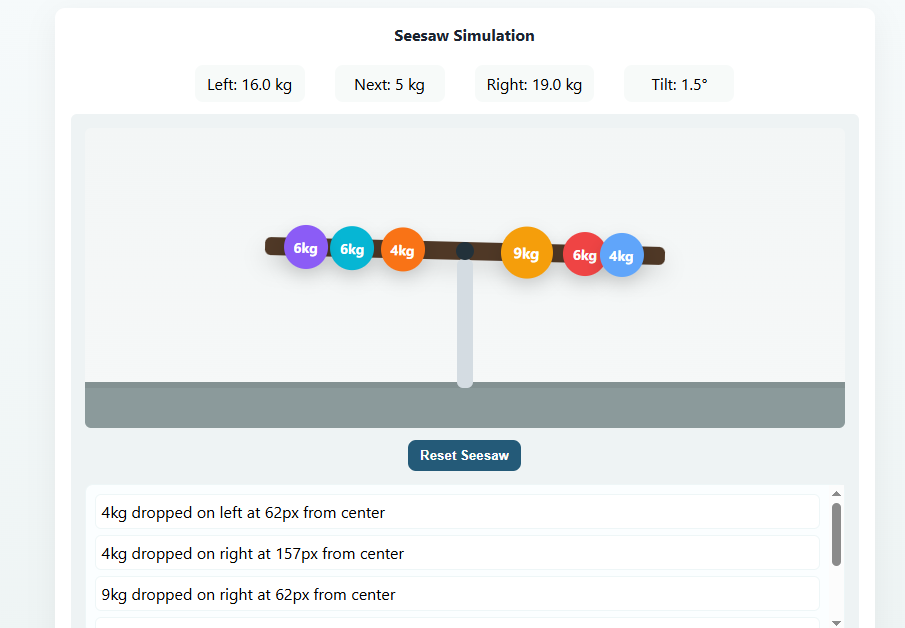

# Seesaw Simulation

A physics-based interactive simulation that demonstrates the principles of balance and mechanical advantage using a virtual seesaw.

## Overview

This project provides a visual and interactive way to understand:
- Basic physics concepts of leverage and fulcrum
- Weight distribution and balance
- Simple harmonic motion
- Basic mechanical principles

Try the simulation to explore how different weights and positions affect the seesaw's behavior in real-time.

## Getting Started

### Installation and Usage

1. Clone the repository or download the project files
2. Open the `index.html` file in your web browser
3. The simulation will start automatically in your browser window

No additional installation or setup is required. The simulation runs directly in your web browser using HTML5 and JavaScript.

